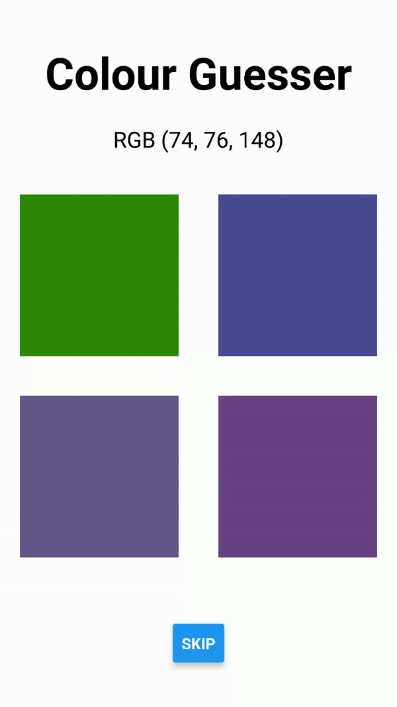

-   RGB colour values are given to the user.
-   The user has to guess the square which matches the exact colour.
-   The user can also skip and it will show a new RGB colour value with new squares.
-   If the user makes a wrong choice, the square will disappear. If correct, an alert will be shown.

